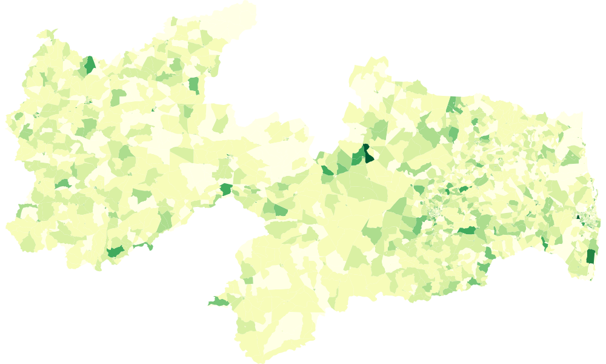

<meta charset="utf-8">

<svg width="400" height="100"></svg>

A visualização acima mostra, com base nos dados do censo do IBGE feito em 2010 (que podem ser conferidos [neste link](https://mapas.ibge.gov.br/bases-e-referenciais/bases-cartograficas/malhas-digitais.html) e que pode ser melhor entendido [aqui](https://analiticaterritorial.wordpress.com/2016/04/19/ibge-entenda-a-diferenca-entre-censo-demografico-e-pnad/) ), a quantidade de crianças e adolescentes alfabetizados nos municípios e regiões paraibanos. É extremamente preocupante que a maior parte do mapa esteja preenchida com cores claras, demonstrando o enorme trabalho que ainda deve ser feito quanto a educação das crianças no nosso país.